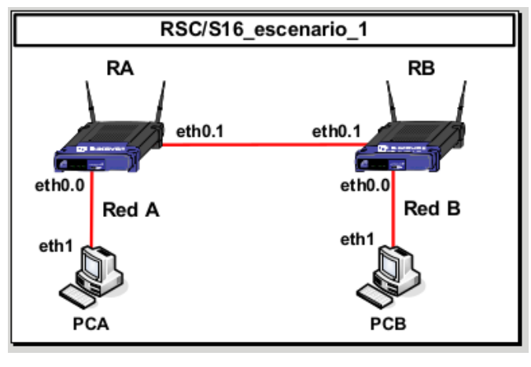
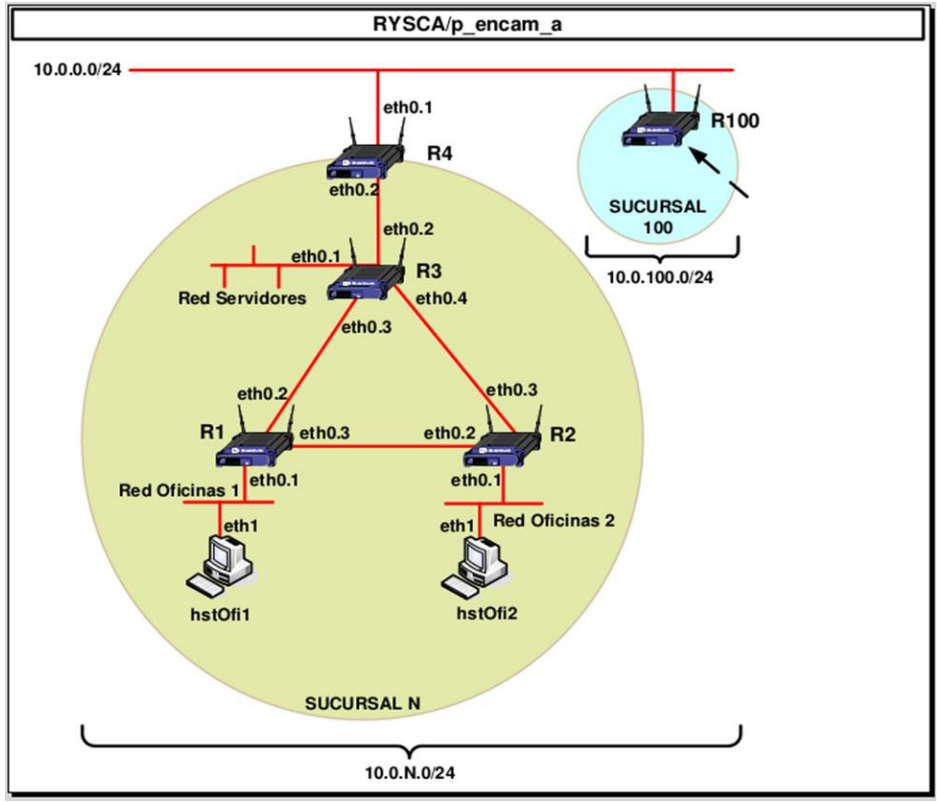

# Routing Lab
By Luis Daniel Casais Mezquida & Javier Moreno Yébenes  
Computer Networks 22/23  
Bachelor's Degree in Computer Science and Engineering, grp. 89  
Universidad Carlos III de Madrid

<!-- TODO: Lightning setup -->

## Part I: Simple network interconnection
### Start the VM and load the scenario.
```bash
student@uc3m lightning start RSC/S16_escenario_1
```

Desired configuration:  


<!-- TODO: Convert to table -->

- Network A: `10.0.3.0/24`.  
- Network B: `10.0.4.0/24`.  
- Network RA-RB: `10.0.0.0/30`.

- RA eth0.0: `10.0.3.2`.  
- RA eth0.1: `10.0.0.1`.  
- RB eth0.0: `10.0.4.2`.  
- RB eth0.1: `10.0.0.2`.  
- PCA eth1: `10.0.3.1`.  
- PCB eth1: `10.0.4.1`.  

### Remove the default IP addresses assigned to the eth0.0 through eth0.4 and wlan0 interfaces in the routers.

```
RA# show interface eth0.0
```

```
[...]
inet=192.168.0.1/24
[...]
```

```
RA# configure terminal  # enter config mode
RA(config)# interface eth0.0  # select interface
RA(config-if)# no ip adress 192.168.0.1/24  # pre-configured IP (one received with show interface)
RA(config-if)# exit
```

Do the same for eth0.1, eth0.2, eth0.3, eth0.4, wlan0, and for router RB.

```
RA(config)# exit
RA# show interface eth0.0  # to check it was done correctly, inet shouldn't show
```

### Assign an IP address to the Ethernet interface of computer PCA that is tagged as eth1 and that is connected to Network A

First we see the asigned IPs for PCA and PCB.
```bash
student@PCA:~$ ip a
```

```
[...]
3: eth1@[...]
[...]
inet=192.100.101/24  # default PCA IP
[...]
```
Remove the default IP.

```bash
student@PCA:~$ sudo ip addr del 192.100.100.101/24 dev eth1
```

Do the same for PCB.


### Assign an IP address to the interface of router A that is connected to the Network A

Add IP to PCA.
```bash
student@PCA:~$ sudo ip addr add 10.0.3.1/24 dev eth1
```

Configure RA interface w/ PCA.
```
RA# configure terminal
RA(config)# interface eth0.0
RA(config-ip)# ip address 10.0.3.2/24
RA(config-ip)# exit 
RA(config)# exit
```

Verify that the router and the host can reach each other using the ping command.

Check that you can ping from PCA to RA.
```bash
student@PCA:~$ ping 10.0.3.2
```


### Connect routers A and B through their Ethernet interfaces.

Assign IP addresses to the interfaces that connect both routers.

```
RA# configure terminal
RA(config)# interface eth0.1
RA(config-ip)# ip address 10.0.0.1/30
RA(config-ip)# exit 
RA(config)# exit
```

```
RB# configure terminal
RB(config)# interface eth0.1
RB(config-ip)# ip address 10.0.0.2/30
RB(config-ip)# exit
RB(config)# exit
```

Verify that routers can reach each other using the ping command.

```
RA# ping 10.0.0.2
```
```
RB# ping 10.0.0.1
```

### Assign an IP address to the interface of router B connected to Network B

Add IP to PCB.
```bash
student@PCB:~$ sudo ip addr add 10.0.4.1/24 dev eth1
```

Configure RB interface w/ PCB.
```
RB# configure terminal
RB(config)# interface eth0.0
RB(config-ip)# ip address 10.0.4.2/24
RB(config-ip)# exit 
RB(config)# exit
```

Verify that the router and the host can reach each other using the ping command.

Check that you can ping from PCA to RA.
```bash
student@PCB:~$ ping 10.0.4.2
```


### Configure in both routers the routing table entries so that router A can reach network B and vice versa

Forward stuff to Network B (`10.0.4.0/24`) through RB eth0.1 (`10.0.0.2`).
```
RA# configure terminal
RA(config)# ip route 10.0.4.0/24 10.0.0.2
```

Forward stuff to Network A (`10.0.3.0/24`) through RA eth0.1 (`10.0.0.1`).

```
RB# configure terminal
RB(config)# ip route 10.0.4.0/24 10.0.0.1
```

### Configure the routing tables in PCA so it can reach Network B.

Route stuff to the outside (`default`/`0.0.0.0/0`), and Network B (`10.0.4.0/24`) through RA eth0.0 (`10.0.3.2`).
```bash
student@PCA:~$ sudo ip route add default via 10.0.3.2
student@PCA:~$ sudo ip route add 10.0.4.0/24 via 10.0.3.2
```

### Perform the corresponding settings in PCB
Route stuff to the outside (`default`/`0.0.0.0/0`), and Network A (`10.0.3.0/24`) through RB eth0.0 (`10.0.4.2`).
```bash
student@PCB:~$ sudo ip route add default via 10.0.4.2
student@PCB:~$ sudo ip route add 10.0.3.0/24 via 10.0.4.2
```

### Use the `ping` and `traceroute` command from PCA to PCB.

```bash
student@PCA:~$ ping 10.0.4.1
student@PCB:~$ ping 10.0.3.1
```
```bash
student@PCA:~$ traceroute -n 10.0.4.1
student@PCB:~$ traceroute -n 10.0.3.1
```

Close lightning with
```bash
student@uc3m lightning stop
```

## Part II: Network configuration

### Start the VM and load the scenario.
```bash
student@uc3m lightning start RYSCA/p_encam_a
```

Configuration:



We'll use the `10.0.98.0/24` segment.

<!-- TODO: Convert to table -->
- Network O1: `10.0.98.0/25`.
- Network O2: `10.0.98.128/27`.
- Network S: `10.0.98.160/28`.
- Network R1-R2: `10.0.98.176/30`.
- Network R1-R3: `10.0.98.180/30`.
- Network R2-R3: `10.0.98.184/30`.
- Network R3-R4: `10.0.98.188/30`.

- R1 eth0.1: `10.0.98.1/25`
- R1 eth0.2: `10.0.98.182/30`
- R1 eth0.3: `10.0.98.177/30`
- R2 eth0.1: `10.0.98.129/27`
- R2 eth0.2: `10.0.98.178/30`
- R2 eth0.3: `10.0.98.185/30`
- R3 eth0.1: `10.0.98.161/28`
- R3 eth0.2: `10.0.98.189/30`
- R3 eth0.3: `10.0.98.181/30`
- R3 eth0.4: `10.0.98.186/30`
- R4 eth0.1: `10.0.0.69/24`
- R4 eth0.2: `10.0.98.190/30`

- hstOfi1 eth1: `10.0.98.2/25`
- hstOfi2 eth1: `10.0.98.130/27`

**DO NOT TOUCH R100.**

### Assign IP addresses to the router interfaces
(for each router Rx, each interface eth0.y)
```
Rx# configure terminal
Rx(config)# interface eth0.y
Rx(config-if)# no ip adress <old_ip>
Rx(config-ip)# ip address <new_ip>  # ip with prefix
Rx(config-ip)# exit 
Rx(config)# exit
```

Also remember to delete wlan0

### Assign IP addresses to the hosts
(for each host hstOfix):
```bash
student@hstOfix:~$ ip a  # show ip
student@hstOfix:~$ sudo ip addr del <old_ip> dev eth1
student@hstOfix:~$ sudo ip addr add <new_ip> dev eth1  # ip with prefix
```

### Check that connectivity exists between PCs hstOfi1, hstOfi2 and the routers R1, R2

Ping from hstOfix to Ry (for each host hstOfix, router Ry):
```bash
student@hstOfix:~$ ping <ip Ry eth0.1>  # ip without prefix
Ry ping <ip hstOfix>
```

### Check connectivity in each of the point-to-point network that interconnects the routers
Ping from Rx ethi to Ry ethj (for each pair of routers in the same network, using the correct interfaces, the ones "pointing" to the other router)
```
Rx# ping <ip Ry ethj>
Ry# ping <ip Rx ethi>
```

### Configure the required static routes in the routers (routing tables)
Remember to put all routes, and that direct connections don't need to be configured.  

The routing tables are:  
R1:
- 10.0.98.128/27 10.0.98.178 O2
- 10.0.98.128/27 10.0.98.181
- 10.0.98.160/28 10.0.98.181 S
- 10.0.98.160/28 10.0.98.178
- 10.0.98.184/30 10.0.98.178 R2-R3
- 10.0.98.184/30 10.0.98.181
- 10.0.98.188/30 10.0.98.178 R3-R4
- 10.0.98.188/30 10.0.98.181
- 10.0.0.0/24 10.0.98.181 internet
- 10.0.0.0/24 10.0.98.178
<!-- TODO: Convert to table -->

R2:
- 10.0.98.0/25 10.0.98.177 O1
- 10.0.98.0/25 10.0.98.186
- 10.0.98.160/28 10.0.98.186 S
- 10.0.98.160/28 10.0.98.177
- 10.0.98.180/30 10.0.98.177 R1-R3
- 10.0.98.180/30 10.0.98.186
- 10.0.98.188/30 10.0.98.186 R3-R4
- 10.0.98.188/30 10.0.98.177
- 10.0.0.0/24 10.0.98.186 internet
- 10.0.0.0/24 10.0.98.177
<!-- TODO: Convert to table -->

R3:
- 10.0.98.0/25 10.0.98.182 O1
- 10.0.98.0/25 10.0.98.185
- 10.0.98.128/27 10.0.98.185 O2
- 10.0.98.128/27 10.0.98.182
- 10.0.98.176/30 10.0.98.182 R1-R2
- 10.0.98.176/30 10.0.98.185
- 10.0.0.0/24 10.0.98.190 internet
<!-- TODO: Convert to table -->


R4:
- 10.0.98.0/24 10.0.98.189
<!-- TODO: Convert to table -->

(for each router Rx, each entry in the routing table)
```
Rx# configure terminal
Rx(config)# ip route <dest> <next hop>  # dest w/ prefix, next hop without
```

You can check the configuration with:
```
Rx# show ip route
```

To delete a configured route:
```
Rx(config)# no ip route <dest> <next hop>
```

### Configure the required static routes in the hosts (routing tables)
(for each host hstOfix connected to router Ry)
```bash
student@hstOfix:~$ sudo ip route add default via <ip Ry eth0.1>
```

You can check the configuration with:
```
student@hstOfix:~$ ip route
```

To delete a configured route:
```
student@hstOfix:~$ sudo ip route del <dest> <next hop>
```

### Check the network is connected
You can both use `ping` and `traceroute` (`traceroute` is more useful for debugging).  

Let's check if it reaches from hstOfi1 to hstOfi2, and vice versa.
```
student@hstOfi1:~$ ping 10.0.98.130
```
```
student@hstOfi2:~$ ping 10.0.98.2
```

Now let's check it reaches outside.
```
student@hstOfi2:~$ ping 10.0.0.69
```

### Force a link failure, use the interface configuration command shutdown to disable the interfaces on both the routers connected to the link

Let's cut link between R1 and R2 and try to reach from hstOfi1 to hstOfi2
```
R1(config)# interface eth0.3
R1(config-if)# shutdown
```

And traceroute:
```
student@hstOfi1:~$ traceroute 10.0.98.130
```
